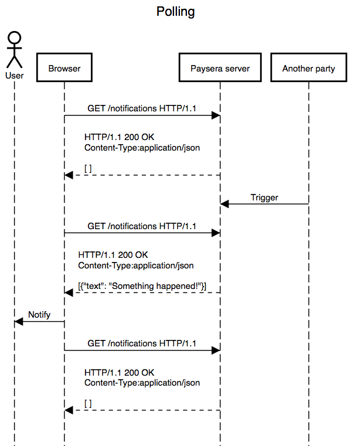

# Real-time PHP sandbox

## Running

```bash
docker-compose up
```

Open [http://localhost:8000/](http://localhost:8000/).

This runs apache server and local [poxa](https://github.com/edgurgel/poxa) instance.

## Idea of this sandbox

`add.html` file sends text to `add.php` script whenever text in textarea changes. The script saves text into
local filesystem and notifies Pusher and local poxa instance about this.

All other files in `/frontend` and `/backend` folders are for demonstrating different synchronisation mechanisms
available.

Google chrome was used for testing.

### Polling



### Long polling


### Forever frame


### Server sent events


### Pusher and poxa (WebSockets)


## Authentication

`authentication.html` file demonstrates `private-` channel support for Pusher and poxa with authentication
hook in backend.

Input `marius` and press `Subscribe`, then edit text for test to work.

Authentication logic is inside `backend/pusher-auth.php`. This is just simple example, you should check if
JWT token is present, active session exists or user has some kind of cookie - just use your common authentication
flows for this.

Make sure you check not only if user is logged in, but if s/he has access to specified channel.
